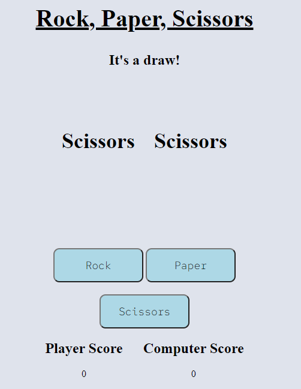

# Two Classic Games 

This is a website where I will host two games; Noughts and Crosses and Rock, paper, Scissors. These have been made in Javascript and will track the scores at the bottom for both of these games. These will be two player games for each one, with a home page to navigate between each one.
 


## Features 

### Existing Features

- __Navigation Bar__

There is a navigation bar the homepage that will allow the user to navigate between the two games.


- __The home page__

 The home page is where the user can navigate between the two games and also has links to my linkedin and github in the footer as well.


- __Noughts and Crosses__

This is the page for Noughts and Crosses, the players play N&C and their score for how many games each player has won. There is a button at the bottom of the page to restart the game and also one to reset the score as well. 


-__Noughts and Crosses: Message box__ 

On the noughts and crosses page, there is a message box just above the game area. This is to let players know who's turn it is and the eventual outcome of the game, with either player winning or a draw is called.


-__Noughts and Crosses: Game Area__

This is the area on the noughts and crosses page where the game itself is played. It's a 3x3 grid where players will click on each box and, once clicked on, that players icon will be placed into that box. Whenever a player places an icon down, two things trigger: The game checks for a winning combination (i.e. 3 in a row) and, if it can't find one, will swap to the other players turn. If the game finds a winning combination, those boxes will behighlighted and all of the boxes will be disabled. A winner is declared and their respective score increases by one as well. 


-__Noughts and Crosses: Scoreboard__ 

Here on the noughts and crosses page is a scoreboard to let the players know how many game each player has won. The scores will increase by one when the respective player wins a game.


-__Noughts and Crosses: Restart the game button__ 

This a button that will allow the players to restart the game: This will clear the board and revert the game back to Crosses turn, just like they were starting a fresh game.


-__Navigation back to the home page__

There is a link in the top left hand corner of the noughts and crosses and rock, paper, scissors page that will allow the user to navigate back to the home page.


-__Rock, paper, Scissors__ 

This is the page for rock, paper, scissors, it consists of a game area where the computer and player choices are displayed, the options for the player to make their choice, a message section above the game area that displays the result from the game. There is also a scoreboard at the bottom of the page to show the score of the player and the computer.

-__Rock, paper, Scissors: Message box__

This displays a message above the game that will show the outcome of the game: either the player or computer wins or the game ends in a draw.


-__Rock, paper, Scissors: Game area__

This is where the options that the player and the computer chose for the game are displayed. 

-__Rock, paper, Scissors: Player options__

Here is where the player can select which option they want to select for that round of the game. When an option is selected, the game will start and the option the player and computer will be displayed. These options are compared and a result for the game is decided based upon these options. 

 

-__Rock, paper, Scissors: Scoreboard__ 

This is the scoreboard for Rock, paper, Scissors. Whenever a winner is declared, their respective score will increase by one.


## Testing 

The purpose of this project was to create a home page with seperate pages for multiple games, Nought and Crosses and Rock, paper, Scissors. I orginally wanted Connect Four instead of Rock, paper, Scissors however, when looking over the examples for this, most examples either used advanced Javascript or where just out of the scope of the project. So I had instead opted for Rock, paper, Scissors as this was more achievable given my experience in Javascript and the scope of the project. For the home page, I have added some media queries due to the size of the pictures and the layout of the page. So at 1200px the images will shrink down to 350px in height and width so they can fit on the page. I orginally just made them thinner but this made the images stretch so I shrunk them in height as well. At 800px I also made it so that the options go from a flex display to a block display so that they take up less width on the screen. I also made the images slightly smaller at this width to better for the size. 


For the Noughts and Crosses game, there was a fair bit of testing I needed to do with for this especially regards to the javascript. I made the game and all it's features rather thin; There's not much that's needed on the screen for the game so I made sure to make it quite thin and centred so that I wouldn't need to worry about whether the screen was a phone, tablet or computer screen. I have a fairly large monitor and the game is big enough and doesn't look odd with the unused space on the sides to me and shrinks down for thinner screens easily enough as well. 

So when I made this game I orginally intended on having the choice of playing against AI or a player however in the end I opted to have it so that it was only playable against another player. This was due to how you can program the 'AI' for these games and, from what I could see online and through my research, there were only two viable ways I could do this; Either the computer chooses at random or they follow a specific algorithm/set of decisions when making their move and neither of these I particularly liked. I originally intended for random however this led to a rather unsatisfying playing experience; the AI could be a move away from winning and just selects a square that wasn't relevant and lose because of it. It just seemed a little wrong to me so I decided against that for the AI and instead looked to more structured AI which has the opposite problem; it's way too good at the game. From my research online, the other way to program the AI for this is called "MinMax" whereby it will select moves that maximise the chance of winning whilst minimising the chance of losing. I have played against this myself to test it out and it leads to only being able to at best draw as noughts and being able to win as crosses by playing the same moves every game as it can't change its strategy so to speak. These seemed to be the only viable ways I could see and think of myself to make an AI. A potential 'fix' to this could of been to have a function in place at the start of each game to randomly decide between the two personalities so to speak, to make the AI feel a bit different each time. But again I opted against this as these two are so far apart in difficultly that it would've been jarring to play against each time. So ulitmately after all that, I decided to keep the game as player vs player as this seemed more appropriate for this type of game due to limitations in the AI that i had. 

Now for the actual game itself, I researched various different ways to make the game and most iterations of the game where made using other forms of coding languages/stuff outside the scope of the project such as using Python and JQuery. I eventually found a way to make it using purely javascript and used that as a guideline for my code, where I would style it in my own way and also add to it as well with my own features. The first part was making the grid itself, I have the "grid" div in HTML that refers to the actual playing space itself with each div within that representing one of the nine boxes in Noughts and Crosses. This was then styled in css to show that on screen; The grid is a width of 238px simply due to the background being even at that width, any more and it protrudes on the right hand side so I played around with the width until I was happy with 238px. So after styling it I then proceeded to start coding it for the actual functionality of the game. 


For the styling of the games, I originally had it that there were two messages at the top, one stating who's turn it was and that crosses would start. However I streamlined this down to only one message as it looked a little odd to me having the "Crosses start" message the entire way through the game. So now the "Crosses start" message gets replaced with who's turn it is and the outcome of the game, declaring a winner or a draw. 

So the script for the game essentially works like this; the players click on a square in the grid and the game constantly compares the boardstate to the winningArrays, as soon as one of the players gets three in a row, the script sees that as a winning array and declares that player a winner and adds one to their score at the bottom. If the game doesn't see a combination that matches that winning array, it will instead declare it a draw. The board can be reset by clicking the "Restart the game" button on the screen. 

A fair amount of testing came from how to implement the scoreboard for the game. I knew it needed to be triggered during the declareWinner secion of the script and originally tried having variables at the top of the script, crossesScore and noughtsScore. I then tried calling on these within the declareWinner section with the intent on adding to them using ++ to add one to the variable to show a win. This initially didn't work due to me not coding it properly but was a flawed way of doing it for two reasons; it was a lengthy bit of code to add in the if statement and also I returning the declareWinner statement which can cause issues for any code after it. When something is returned in a loop or function in javascript, any code after becomes unreachable and thus unable to run. This in some cases can be resolved by placing the return statement at the end of the code however I wanted to tidy up the code so instead got rid of the variables and code to add the score and made them into seperate functions, crossesScore and noughtScore. These when called add 1 to their respective score. However the problem still remains with returning the declareWinner statement as that messes up the process, even if I put it after the score function. So to resolve this I also made the declareWinner statement into a function and changed checkForWinner statement accordingly as well so that it would call for both and add to the score when that person won. 

Another bug that came up whilst testing that came from the scoreboard system was declaring a winner. So when the game ran, it will pin point out the winner however I originally had not coded it to stop when a winner was found. This meant that you could keep clicking any open boxes and add one to winning score for each click, meaning someone could score multiple points in one game. It could also potentially declare two winners in one game as it checks for a winner after every click. So to remedy this, I disabled the boxes after a winning combination was found. So when a winner was found, box.disabled = true so anymore clicks on a box won't do anything. Only until the "restart the game" buton is clicked is when the boxes will be able to be clicked again, as this sets box.disabled to false. 


 

So now, when trying to click a box after a winner is declared, nothing will happen thus a winner can only be declared once and the score can be tracked properly. 


As I also made a Rock, Paper, Scissors game for this project, I also needed to do more testing for this. For the code, there are two main components to it: a function that triggers on clicking an option that make the computer choose and the game start. There is also another function where the result of the game is calculated based upon the choices of the player and computer and those results are outputted accordingly. There is also a similar  I will write about the second of these functions first as this became the more simple one of the two.

So this function is a decision tree; if the player chose Rock for example, the function compares that to the computers choice and calculates a result accordingly; So if the computer chose Scissors in this example, it would calculate that the player won and would out that result and increase their score as well. This orginally was a long if statement which worked however this was instead changed to a switch case structure as this was less messy in terms of code and easier to follow. For this part of the code, there wasn't too much I needed to do testing wise as it more or less luckily worked first try. The main issues came from the first function and implementing that. 

The first function, playerOptions, this was a sticking point for this project; I was having trouble getting these buttons and if they didn't work, the game couldn't even start. This at first was a problem on my part due to assigning the wrong code to the buttons. So to look at rockBtn again, this originally was a document.querySelector rather than the document.getElementById. In its original form, it made it so that the script couldn't see what rockBtn was thus, when clicked, nothing happened as the button did nothing. Another issue I had made was accidentally placing the line of code to call the javascript outside of the body in HTML. This causes similar issues as it causes the script to be called before the page has loaded meaning slower load times and problems such as buttons and other elements being given a value of 'null'. So once these two parts where corrected, the buttons now worked however I hadn't implemented the playerOptions function properly as of yet. 

The playerOptions function originally worked as follows: when an option was clicked, the computer would randomly choose an option from the three options and assign that value to a value called computerChoice. Then the game function was called with the computerChoice being called with the closed brackets e.g. game(computerChoice). This allowed the game run however it made both the playerChoice and computerChoice values the same I had not called on it so every game played was ending in a draw and also every button press to be random. So the player might click Rock and instead on the screen it displays Paper which is not ideal. 



So I first tried to remedy this by adding this.innerText to when the game function i.e. game(this.innerText, computerChoice). This wasn't running the code though so I instead added playerChoice = this.id to the function which assigned a value to playerChoice, specifically the one the player chose. This was also added to be called with the game function so that both were called when the game was to run thus it could properly assign a value for the player rather duplicating the computers choice. After this was resolved, the rest of the game ran smoothly and now displays a winner or a draw and the respective score increases with every win as well. 

For both of the games, I also added a navigation button in the top left hand corner so that the user can easily navigate back to the home page as well. Otherwise, without this, their isn't a way for them to navigate to the home page within the website. 


### Validator Testing 

- HTML
  - No errors were returned when passing through the official [W3C validator](https://validator.w3.org/nu/?doc=https%3A%2F%2Fchcheshire.github.io%2FProject-1-Warhammer%2F)
- CSS
  - No errors were found when passing through the official [(Jigsaw) validator](http://jigsaw.w3.org/css-validator/validator?lang=en&profile=css3svg&uri=https%3A%2F%2Fchcheshire.github.io%2FProject-2&usermedium=all&vextwarning=&warning=1)

### Unfixed Bugs


## Deployment

The site was deployed to GitHub pages. The steps to deploy are as follows: 
  - In the [GitHub repository](https://github.com/CHCheshire/Project-1-Warhammer), navigate to the Settings tab 
  - From the source section drop-down menu, select the **Main** Branch, then click "Save".
  - The page will be automatically refreshed with a detailed ribbon display to indicate the successful deployment.

The live link can be found [here](https://chcheshire.github.io/Project-1-Warhammer/)

### Local Deployment

In order to make a local copy of this project, you can clone it. In your IDE Terminal, type the following command to clone my repository:

- `git clone https://github.com/CHCheshire/Project-1-Warhammer.git`

Alternatively, if using Gitpod, you can click below to create your own workspace using this repository.

[](https://gitpod.io/#https://github.com/CHCheshire/Project-1-Warhammer)


## Credits 

### Content 


### Media


```js
if (playerChoice == "rock") {
    if (computerChoice == "scissors") {
        playerOption.innerText = `Rock`;
        computerOption.innerText = `scissors`;
        message.innerText = `Player wins!`;
        playerScore();
    } else if (computerChoice == "paper") {
        playerOption.innerText = `Rock`;
        computerOption.innerText = `Paper`;
        message.innerText = `Computer wins!`;
        computerScore();
    } else {
        playerOption.innerText = `Rock`;
        computerOption.innerText = `Rock`;
        message.innerText = `It's a draw!`;
    }
}
if (playerChoice == "paper") {
    if (computerChoice == "rock") {
        playerOption.innerText = `Paper`;
        computerOption.innerText = `Rock`;
        message.innerText = `Player wins!`;
        playerScore();
    } else if (computerChoice == "scissors") {
        playerOption.innerText = `Paper`;
        computerOption.innerText = `Scissors`;
        message.innerText = `Computer wins!`;
        computerScore();
    } else {
        playerOption.innerText = `Paper`;
        computerOption.innerText = `Paper`;
        message.innerText = `It's a draw!`;
    }
}
if (playerChoice == "scissors") {
    if (computerChoice == "paper") {
        playerOption.innerText = 'Scissors';
        computerOption.innerText = `Paper`;
        message.innerText = 'Player Wins!'
        playerScore();
    } else if (computerChoice == "rock") {
        playerOption.innerText = `Scissors`;
        computerOption.innerText = `Rock`;
        message.innerText = `Computer wins!`;
        computerScore();
    } else {
        playerOption.innerText = `Scissors`
        computerOption.innerText = `Scissors`
        message.innerText = `It's a draw!`
    }
}
```